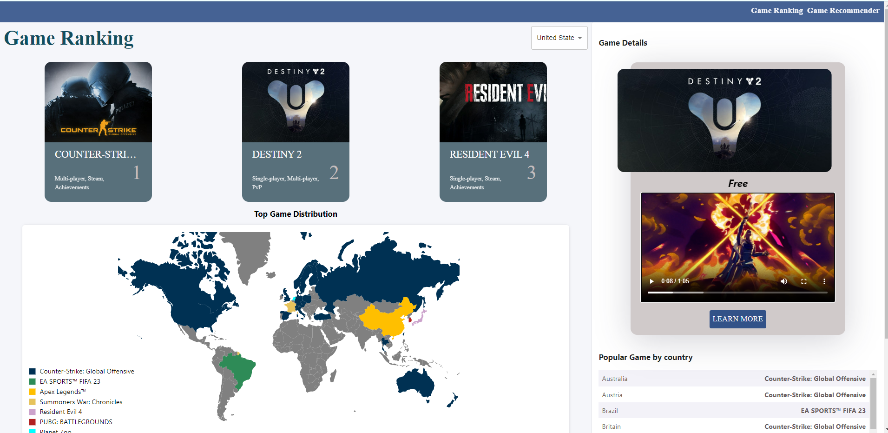
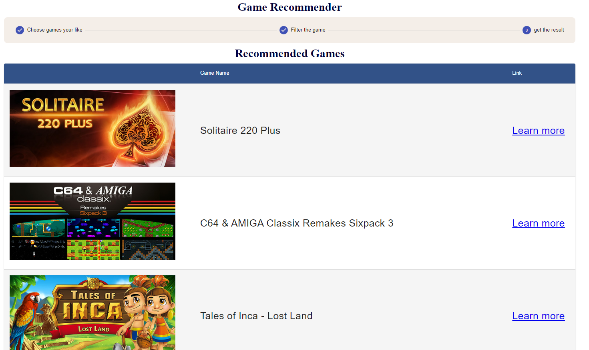

# Game Trending Visualization and Game Recommender System(FrontEnd)

## Introduction
The frontend part of CSE6242 final project, where users can see game trending in over 30 countries and
get new games recommended by our ML system based on game history. The website is developed based on React
and Java(Spring Boot).

## Essential Dependencies
If the node_modules file is not included in project, please run the command below
to install essential dependencies before running.
### `npm install @mui/material axios d3 d3-svg-legend http-proxy-middleware react`
## Usage
In the project directory, you can run:
### `npm start`
to start project.

Open [http://localhost:3000](http://localhost:3000) to view it in the browser.

Since the front-end and back-end are kept separated in project, the backend part is
also needed to be activated, then the site is available for data visualization and game recommendations.

## Contribution
Ruiqi Liu, Peizhen Zheng, Shancheng Jiang, Xinhan Yang

